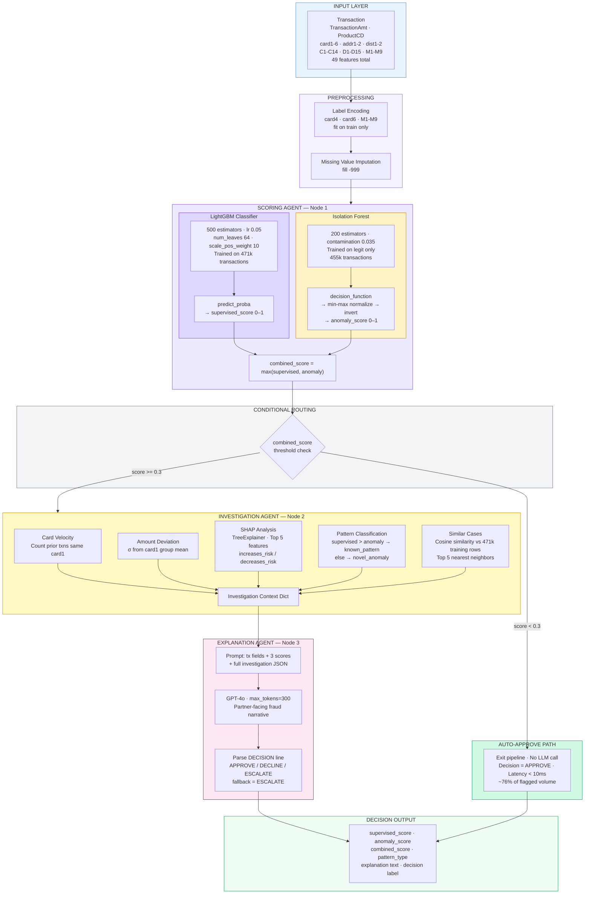
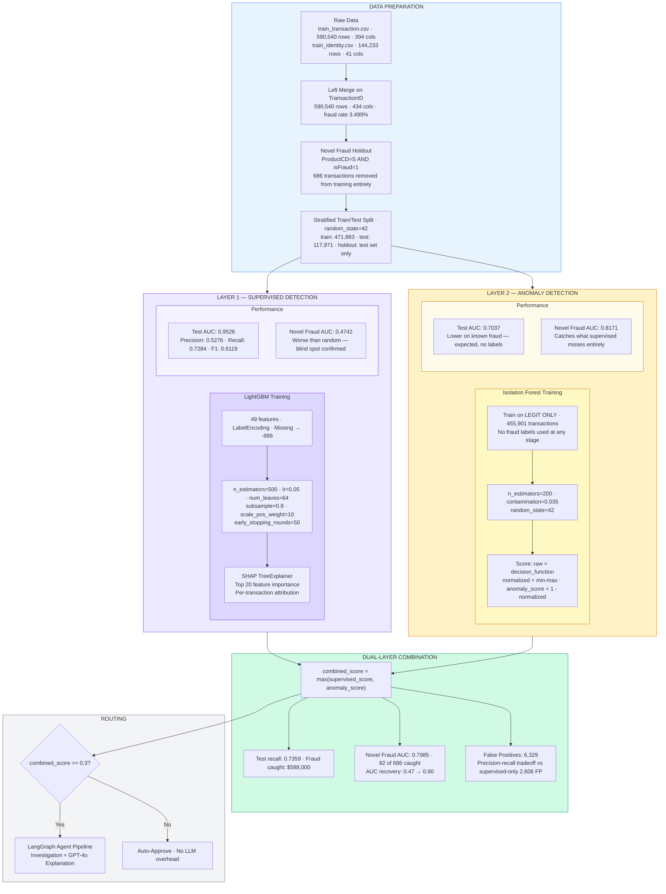
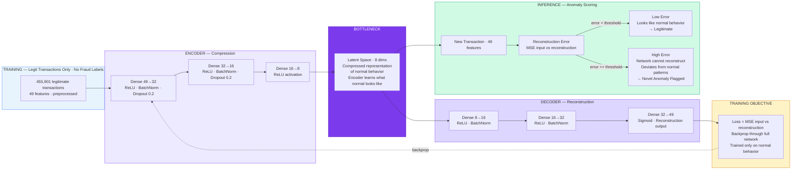
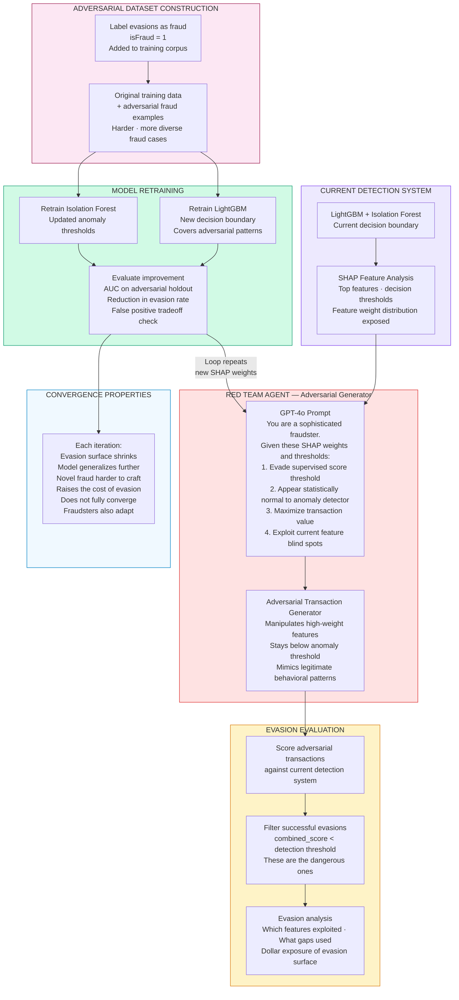

# Agentic Fraud Detection

A research prototype combining supervised fraud detection, unsupervised novel pattern discovery, and a LangGraph multi-agent investigation layer with GPT-4o generated partner-facing explanations.

   

---

## The Problem

Most fraud detection systems are strong at catching patterns that resemble historical fraud. They are structurally blind to fraud they have never seen before. A supervised model trained on labeled data cannot, by definition, flag a fraud pattern it was never shown.

This project addresses that gap directly:

- **Known fraud** is handled by a LightGBM classifier trained on labeled historical transactions
- **Novel fraud** — patterns the supervised model has never seen — is surfaced by an Isolation Forest anomaly detector trained exclusively on legitimate transactions
- **Every flagged transaction** is investigated and explained in plain English by a LangGraph agent pipeline powered by GPT-4o

---

## The Novel Fraud Simulation

To rigorously evaluate novel fraud detection, an entire fraud subcategory (`ProductCD == 'S'`, 686 transactions) is withheld from training entirely and included only in the test set. The supervised model has genuinely never seen these patterns at inference time.

This mirrors how real fraud teams evaluate out-of-distribution detection capability — not by claiming a model generalizes, but by proving it on a held-out category it was never shown.

---

## Key Results

| Detection Mode | Known Fraud AUC | Novel Fraud AUC | Fraud Caught ($) |
|---|---|---|---|
| Supervised only | 0.9526 | 0.4742 | $582,000 |
| Anomaly only | 0.7037 | 0.8171 | $146,400 |
| Combined (dual-layer) | 0.9169 | 0.7985 | $588,000 |

**The headline finding:** The supervised model scores AUC 0.47 on novel fraud — worse than random. The anomaly layer recovers this to AUC 0.80 on the exact same transactions, purely by recognizing behavioral deviation from normal rather than matching known fraud patterns.

---

## Architecture

### Diagram 1 — LangGraph Agent Pipeline



The three-agent design is deliberate. Low-risk transactions exit after scoring without ever hitting the LLM — keeping latency and cost minimal for the majority of volume. The LLM only runs where human-readable explanation actually adds value.

---

### Diagram 2 — Dual-Layer Detection Architecture



---

## Tech Stack

| Layer | Tools |
|---|---|
| Supervised detection | LightGBM, SHAP |
| Anomaly detection | Isolation Forest (scikit-learn) |
| Agent orchestration | LangGraph, LangChain |
| LLM explanation | OpenAI GPT-4o |
| API | FastAPI |
| Frontend | Streamlit |
| Data processing | Pandas, NumPy, PySpark |

---

## Dataset

[IEEE-CIS Fraud Detection](https://www.kaggle.com/competitions/ieee-fraud-detection/data) — `train_transaction.csv` + `train_identity.csv` merged on `TransactionID`.

- 590,540 transactions
- 3.5% fraud rate
- 434 features after merge
- Novel fraud holdout: 686 transactions (ProductCD=S, isFraud=1) withheld from training

---

## Project Structure

```
agentic-fraud-detection/
├── data/                       ← place Kaggle CSVs here
├── models/
│   ├── supervised.py           ← LightGBM training + SHAP
│   ├── anomaly.py              ← Isolation Forest training
│   └── evaluator.py            ← detection comparison tables
├── agents/
│   └── graph.py                ← LangGraph pipeline
├── api/
│   └── main.py                 ← FastAPI endpoints
├── outputs/
│   └── eda/                    ← saved plots and CSVs
├── eda.py                      ← exploratory analysis
├── app.py                      ← Streamlit frontend
└── requirements.txt
```

---

## How to Run

**1. Install dependencies**
```bash
pip install -r requirements.txt
```

**2. Download dataset**

Download `train_transaction.csv` and `train_identity.csv` from [Kaggle](https://www.kaggle.com/competitions/ieee-fraud-detection/data) and place in `data/`.

**3. Set environment variables**
```bash
# Create .env file in project root
OPENAI_API_KEY=your_key_here
```

**4. Run in order**
```bash
# Exploratory analysis
python eda.py

# Train models
python models/supervised.py
python models/anomaly.py
python models/evaluator.py

# Launch app
streamlit run app.py

# Optional: API
uvicorn api.main:app --reload
```

---

## Streamlit App

**Tab 1 — Transaction Evaluator**

Loads and scores all flagged transactions (combined score > 0.3) from the test set on startup. Click any row to run the full agent pipeline in real time — scoring, SHAP investigation, behavioral context, and GPT-4o explanation fire instantly for the selected transaction.

**Tab 2 — Model Performance**

Pre-computed detection metrics across all three modes, dollar impact chart, and false positive comparison. The novel fraud holdout results are the key section — they show exactly where supervised-only systems leak value.

---

## Design Decisions Worth Noting

**Why Isolation Forest over an Autoencoder?**
For a research prototype, Isolation Forest is interpretable and fast to train. An Autoencoder would learn richer representations of normal behavior and likely improve novel fraud recall — a natural next step.

**Why GPT-4o for explanation rather than rule-based templates?**
Rule-based templates are fast but brittle. GPT-4o synthesizes SHAP values, velocity signals, amount deviation, and similar case context into a coherent narrative that adapts to each transaction's specific risk profile. For a fraud operations team reviewing hundreds of alerts, explanation quality directly affects analyst efficiency.

**Why ESCALATE as a decision output?**
Novel fraud detection cannot be fully automated. When the anomaly score dominates over the supervised score — indicating the system is outside its training distribution — the correct response is to route to a human reviewer rather than make an autonomous decision. The ESCALATE path is not a fallback; it is the architecturally correct output for genuine uncertainty.

**The false positive tradeoff**
The combined model generates more false positives (6,329) than supervised-only (2,606). This is the fundamental precision-recall tradeoff in fraud detection. In production, the threshold would be tuned based on the business cost of each error type — missing fraud vs. incorrectly declining a legitimate customer. This project surfaces that tradeoff explicitly rather than optimizing a single metric.

---

## Limitations

- IEEE-CIS is transaction fraud data. The dual-layer detection methodology applies equally to identity fraud and credit risk domains — the feature space and model architecture transfer; the domain-specific signal engineering does not.
- The novel fraud simulation uses a single withheld subcategory. Real novel fraud is more diverse and adversarial than a clean holdout split can capture.
- Cosine similarity for similar case retrieval runs against the full training set on each query. In production, approximate nearest neighbor search (FAISS) would be necessary at scale.
- GPT-4o explanation quality depends on the richness of the investigation context passed to it. Thin behavioral context produces generic explanations.

---

## Future Work

### Deep Learning Anomaly Detection — Autoencoder

The current anomaly layer uses Isolation Forest, which detects outliers based on feature-level statistical isolation. The natural upgrade is a **deep autoencoder** trained on legitimate transactions only.

The intuition: an autoencoder learns to compress and reconstruct normal behavior through a neural network bottleneck. At inference, it attempts to reconstruct any incoming transaction. If reconstruction error is high, the network couldn't "understand" the transaction — meaning it deviates from learned normal behavior in ways that go beyond simple statistical outliers.

This is more powerful than Isolation Forest because it learns deep feature interactions and subtle behavioral correlations that tree-based methods miss. A transaction that passes all individual feature checks can still fail reconstruction if its *combination* of signals is unlike anything the autoencoder learned as normal.



### Adversarial Red Team Agent

The deeper limitation of any static fraud detection system is that fraudsters adapt. A model trained today will degrade as fraud patterns evolve to evade it. This is not a theoretical concern — it is the operational reality of every production fraud system.

The planned extension is an **adversarial agent** that actively probes the detection system to find evasion strategies, then feeds those strategies back into retraining.



This closes the loop the current architecture leaves open: the system learns not just from fraud that happened, but from fraud that *could* happen given what it currently knows.

---

## Author

Ishan Joshi — [GitHub](https://github.com/nishaanjoshi0) · [LinkedIn](https://linkedin.com/in/ishannjoshi)
