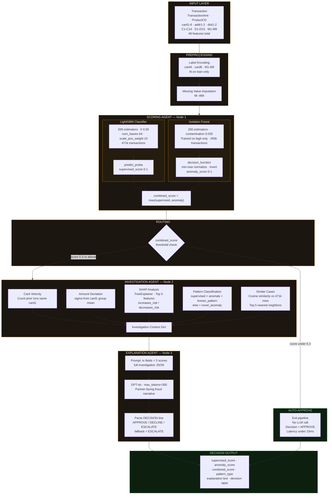
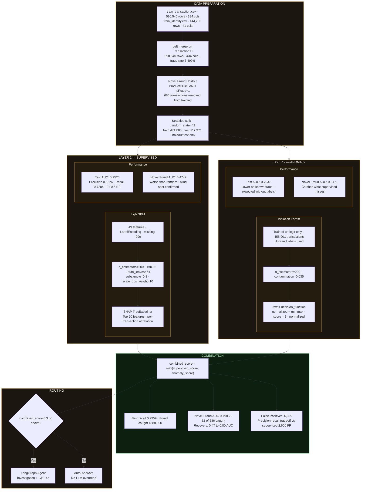
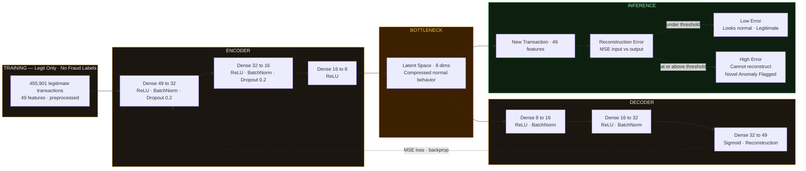
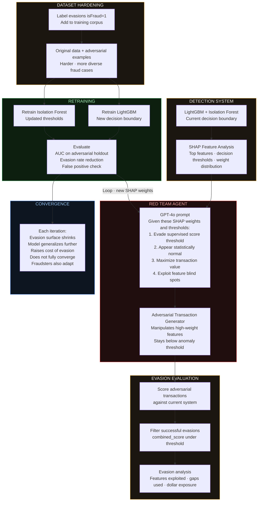

# Agentic Fraud Detection

Research prototype. Supervised fraud detection + unsupervised novel pattern discovery + LangGraph multi-agent investigation layer with GPT-4o explanations.

   

---

## Problem

Supervised fraud models catch patterns that match historical fraud. They are structurally blind to fraud they have never been shown. A model trained on labeled data cannot flag a pattern that does not exist in its training set.

This project targets that gap across two layers:

- **Known fraud** handled by LightGBM trained on labeled historical transactions
- **Novel fraud** surfaced by Isolation Forest trained exclusively on legitimate transactions, with no fraud labels
- **Every flagged transaction** investigated and explained by a LangGraph agent pipeline powered by GPT-4o

---

## Novel Fraud Simulation

An entire fraud subcategory (`ProductCD == 'S'`, 686 transactions) is withheld from training and placed only in the test set. The supervised model has never seen these patterns at inference time.

This is not a standard train/test split. It is an out-of-distribution evaluation: proving the system catches fraud categories it was never shown, rather than claiming generalization without evidence.

---

## Results

| Detection Mode | Known Fraud AUC | Novel Fraud AUC | Fraud Caught |
|---|---|---|---|
| Supervised only | 0.9526 | 0.4742 | $582,000 |
| Anomaly only | 0.7037 | 0.8171 | $146,400 |
| Combined | 0.9169 | 0.7985 | $588,000 |

Supervised AUC on novel fraud: **0.47** (worse than random). Anomaly layer on the same transactions: **0.80**. The delta is the business case for the dual-layer architecture.

---

## Architecture

### 1. LangGraph Agent Pipeline



Low-risk transactions exit after scoring without hitting the LLM. The LLM runs only where a human-readable explanation adds value. This keeps cost and latency minimal across the majority of volume.

---

### 2. Dual-Layer Detection Architecture



---

## Tech Stack

| Layer | Tools |
|---|---|
| Supervised detection | LightGBM, SHAP |
| Anomaly detection | Isolation Forest |
| Agent orchestration | LangGraph, LangChain |
| LLM explanation | OpenAI GPT-4o |
| API | FastAPI |
| Frontend | Streamlit |
| Data processing | Pandas, NumPy |

---

## Dataset

[IEEE-CIS Fraud Detection](https://www.kaggle.com/competitions/ieee-fraud-detection/data): `train_transaction.csv` + `train_identity.csv` merged on `TransactionID`.

- 590,540 transactions · 3.5% fraud rate · 434 features after merge
- Novel fraud holdout: 686 transactions (ProductCD=S, isFraud=1) withheld from training entirely

---

## Project Structure

```
agentic-fraud-detection/
├── data/                       place Kaggle CSVs here
├── models/
│   ├── supervised.py           LightGBM training + SHAP
│   ├── anomaly.py              Isolation Forest training
│   └── evaluator.py            detection comparison tables
├── agents/
│   └── graph.py                LangGraph pipeline
├── api/
│   └── main.py                 FastAPI endpoints
├── outputs/
│   └── eda/                    saved plots and CSVs
├── eda.py                      exploratory analysis
├── app.py                      Streamlit frontend
└── requirements.txt
```

---

## How to Run

```bash
pip install -r requirements.txt
```

Add `OPENAI_API_KEY=your_key` to a `.env` file in the project root.

```bash
python eda.py
python models/supervised.py
python models/anomaly.py
python models/evaluator.py
streamlit run app.py
```

---

## Streamlit App

**Tab 1 — Transaction Evaluator**

Loads and scores all flagged transactions on startup. Click any row to run the full agent pipeline in real time: scoring, SHAP investigation, behavioral context, and GPT-4o explanation.

**Tab 2 — Model Performance**

Pre-computed metrics across all three detection modes, dollar impact chart, and false positive comparison. The novel fraud holdout section is the key finding.

---

## Design Decisions

**Isolation Forest over Autoencoder**
Isolation Forest is interpretable and fast for a research prototype. An autoencoder learns richer representations of normal behavior and would improve novel fraud recall at the cost of training complexity. That is the natural next step.

**GPT-4o over rule-based templates**
Templates are fast but rigid. GPT-4o synthesizes SHAP values, velocity signals, amount deviation, and similar case context into a narrative that adapts to each transaction's specific risk profile. For a fraud operations team reviewing hundreds of alerts daily, explanation quality directly affects analyst throughput.

**ESCALATE as a first-class decision**
Novel fraud detection cannot be fully automated. When anomaly score dominates over supervised score, the system is outside its training distribution. The correct output is a human reviewer, not an autonomous decline. ESCALATE is not a fallback. It is the architecturally correct response to genuine uncertainty.

**False positive tradeoff**
Combined model: 6,329 false positives. Supervised only: 2,606. Adding the anomaly layer casts a wider net. In production the threshold gets tuned against the business cost of each error type: missed fraud vs. declined legitimate customer. This project surfaces that tradeoff rather than hiding it behind a single optimized metric.

---

## Limitations

- IEEE-CIS is transaction fraud data. The dual-layer methodology transfers to identity fraud and credit risk domains. The feature engineering does not.
- Novel fraud simulation uses one withheld subcategory. Real novel fraud is more diverse and adversarial than a clean holdout split captures.
- Cosine similarity for similar case retrieval runs against the full training set per query. Production deployment requires approximate nearest neighbor search (FAISS) at scale.
- GPT-4o explanation quality depends on the richness of investigation context. Thin context produces generic output.

---

## Future Work

### Autoencoder for Novel Fraud Detection

Isolation Forest detects statistical outliers at the feature level. A deep autoencoder learns what normal looks like at a structural level and catches deviations that tree-based methods miss.

Trained on legitimate transactions only, the network learns to compress and reconstruct normal behavior. At inference, high reconstruction error signals the transaction deviates from learned normal patterns regardless of whether it matches any known fraud label.



---

### Adversarial Red Team Agent

Static fraud systems degrade as fraud patterns evolve to evade them. The planned extension is an adversarial agent that probes the detection system for evasion strategies and feeds those strategies back into retraining.



The system learns not just from fraud that happened, but from fraud that could happen given what it currently knows.

---

## Author

Ishan Joshi · [GitHub](https://github.com/nishaanjoshi0) · [LinkedIn](https://linkedin.com/in/ishannjoshi)
